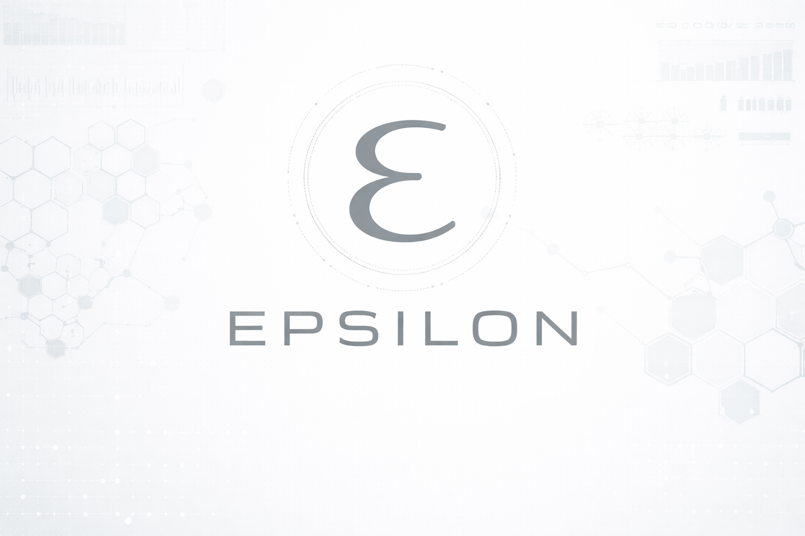

# Epsilon



Epsilon is infrastructure for structured agent workloads.

It gives you a runtime for:

- single-agent coding tasks
- multi-agent software builds
- large manifest-backed workloads with `work_queue`, `sharded_queue`, and `map_reduce`

The core idea is simple: use agents where judgment is useful, keep intermediate outputs structured, and use deterministic reducers where consistency and scale matter more than open-ended reasoning.

## Why It Exists

Most AI tooling is built around one prompt, one model call, and one output.

That breaks down when you need to:

- split work across many agents
- retry failed work without restarting the whole job
- keep intermediate artifacts machine-readable
- selectively escalate only the cases that need deeper reasoning
- mix LLM steps with deterministic aggregation and validation

Epsilon is for workloads that are too structured for a chat app and too judgment-heavy for a plain data pipeline.

## What You Can Build

- software builds with decomposition, QA, and fix loops
- document extraction and curation workflows
- benchmark/result harvesting across large corpora
- manifest-backed workloads that fan out to tens, hundreds, or thousands of agent tasks
- custom agent systems using the BYOA adapter path

## Quickstart

### 1. Create a virtualenv and install dependencies

```bash
make install
```

If you prefer to do it manually:

```bash
python3 -m venv .venv
. .venv/bin/activate
pip install -r requirements.txt
pip install pytest-mock
```

### 2. Set model credentials

```bash
export OPENAI_API_KEY=...
# or
export ANTHROPIC_API_KEY=...
```

### 3. Run a single agent

```bash
PYTHONPATH=. .venv/bin/python runtime/agent_main.py \
  "Write a Python script that converts CSV to JSON"
```

### 4. Run an orchestrated task

```bash
PYTHONPATH=. .venv/bin/python orchestrate.py --pattern dag \
  "Build a URL shortener service"
```

### 5. Run the core test suite

```bash
make test-core
```

## Topologies

Use:

- `dag` for parallel build work with QA/fix loops
- `tree` for hierarchical team-style decomposition
- `pipeline` for staged delivery
- `supervisor` for adaptive retries and task splitting
- `work_queue` for flat pull-based worker execution
- `sharded_queue` for very large independent item sets
- `map_reduce` for hierarchical aggregation workloads

`sharded_queue` and `map_reduce` are intentionally manifest-backed. They are meant for explicit high-scale workloads, not free-form decomposition from a single natural-language task.

To list supported patterns:

```bash
PYTHONPATH=. .venv/bin/python orchestrate.py --list-patterns
```

## Docker And Release Packaging

Build the local image:

```bash
make docker-build
```

Run a containerized orchestrator:

```bash
docker run --rm -it \
  -e OPENAI_API_KEY \
  epsilon:local \
  "Build a notes API with SQLite"
```

To publish to GHCR from CI, use the workflow in [.github/workflows/publish.yaml](.github/workflows/publish.yaml). For local publishing and release steps, see [docs/release.md](docs/release.md).

## Demos

### HF Entity Graph

This demo turns raw document clusters into a curated entity graph:

1. agents summarize and extract entities
2. reducers detect ambiguous entities across documents
3. a second wave adjudicates only the ambiguous cases

Run it with:

```bash
OPENAI_API_KEY=... \
PYTHONPATH=. .venv/bin/python examples/hf_entity_graph/run_demo.py \
  --sample-size 100 \
  --sample-mode random \
  --sample-seed 17 \
  --worker-count 8
```

Additional examples exist under [examples/README.md](examples/README.md). Some of them rely on local research corpora and are intentionally not featured in the top-level launch README.

## Documentation

- Architecture overview: [docs/architecture.md](docs/architecture.md)
- Technical reference: [docs/technical-reference.md](docs/technical-reference.md)
- Release and packaging notes: [docs/release.md](docs/release.md)
- Examples index: [examples/README.md](examples/README.md)

## Contributing

See [CONTRIBUTING.md](CONTRIBUTING.md) for setup, test, and pull-request guidance.

Contributions are also subject to [CLA.md](CLA.md).

## License

Epsilon is licensed under [Apache 2.0](LICENSE).
