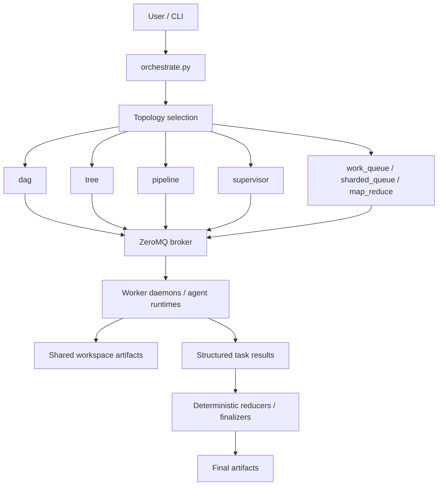
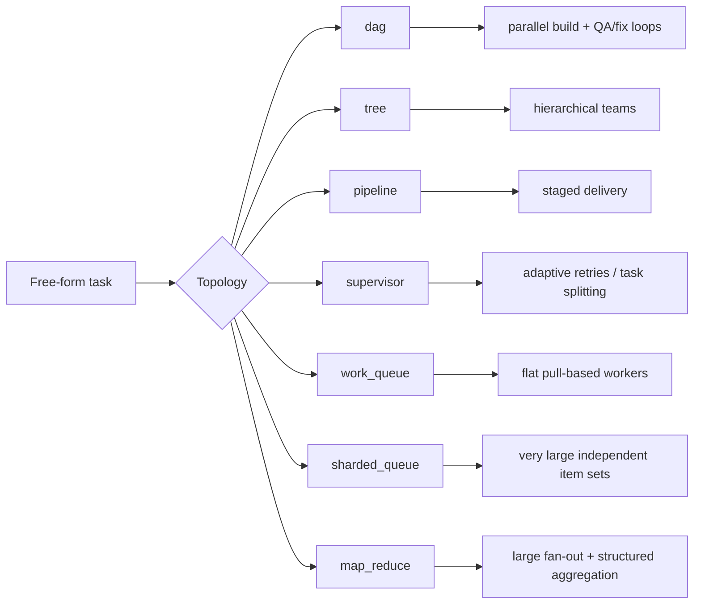

# Architecture Overview

Epsilon is built around a simple split:

- orchestrators decide how work should be decomposed and coordinated
- workers execute individual tasks
- the broker provides queueing, leases, heartbeats, and result routing
- shared workspace artifacts keep intermediate state explicit and inspectable

## System Layout

## Runtime Components

### Orchestrators

Located under `orchestrators/`.

These decide:

- how to decompose a task
- what topology to use
- when to wait for dependencies
- when to retry, reduce, or escalate follow-up work

### Broker

Located under `agent_protocol/`.

The broker is responsible for:

- task assignment
- lease management
- renewals and redelivery
- heartbeats
- dead-letter handling

### Workers

Workers execute the leaves of a topology.

Depending on the workload, a leaf can be:

- an LLM-driven agent task
- a deterministic reducer
- a local executor task such as `local_reduce`
- a BYOA adapter-backed task

### Shared Workspace

Epsilon keeps intermediate outputs on disk rather than hiding them in an internal state machine.

That is important for:

- reproducibility
- reducer/finalizer handoff
- post-run inspection
- future observability/control-plane integration

## Topology Families

## Why The Split Matters

Epsilon is not just “many agents.”

The useful architectural properties are:

- topology is explicit
- agent work and deterministic work can be mixed
- failure handling is isolated to the leaves that failed
- second-pass reasoning can be targeted at only the ambiguous cases

That is what makes the system usable for larger workloads than a single prompt or a naive fan-out pipeline.

## Related Docs

- [technical-reference.md](technical-reference.md)
- [control-plane-telemetry.md](control-plane-telemetry.md)
- [../examples/benchmark_report/README.md](../examples/benchmark_report/README.md)
