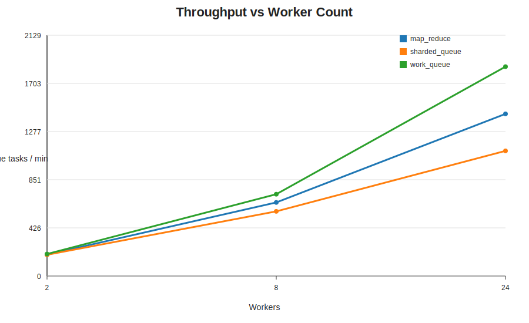
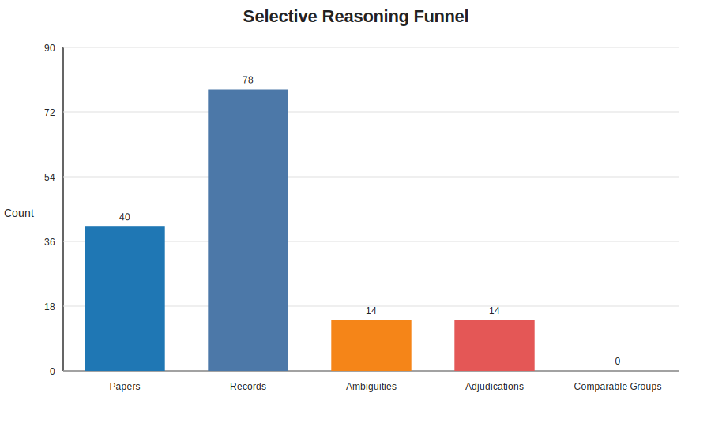
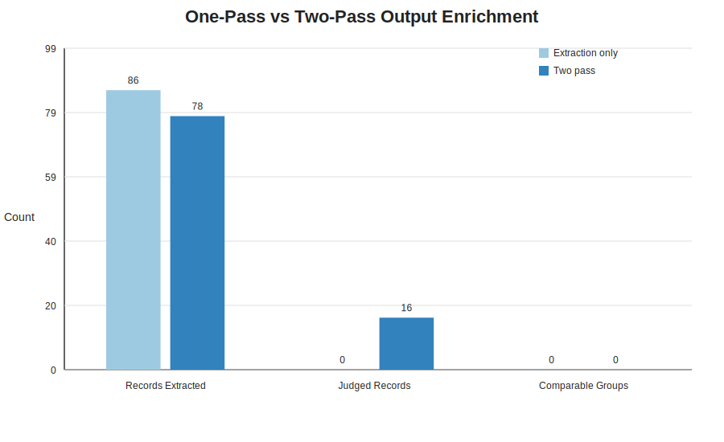

# Quantifying Epsilon

This is a practical write-up of one benchmark run of Epsilon.

The goal was not to produce a full research paper. The goal was to answer two simple questions with actual numbers:

1. Can Epsilon scale operationally across different large-agent topologies?
2. Does the second wave of agents do something meaningful, or is it just extra runtime?

We now have a benchmark bundle that answers both.

## What We Ran

The benchmark used two tracks.

### 1. Scale track

For scale, we used the deterministic `local_reduce` workload so the numbers would reflect orchestration behavior rather than model/network variance.

Configuration:

- topologies: `work_queue`, `sharded_queue`, `map_reduce`
- worker counts: `2`, `8`, `24`
- input items: `240`

This produced `9` scale runs total.

### 2. Semantic track

For semantic behavior, we used the Benchmark Scout demo on a seeded random slice of the local S2ORC computer science corpus.

Configuration:

- corpus: `/home/matt/gcs-downloads/s2orc_computer_science_7_14_parquet`
- sample size: `40` papers
- sample mode: `random`
- sample seed: `17`
- worker count: `8`

We ran it in two modes:

- `extraction_only`: extract benchmark rows, but disable ambiguity escalation
- `two_pass`: extract rows, detect ambiguous comparisons, then adjudicate them with a second wave of agents

## Result 1: Epsilon Scales Cleanly

All `9` scale runs completed successfully.

- failures: `0`
- missing tasks: `0`

The fastest run was `work_queue` at `24` workers:

- `1850.90` queue tasks/min
- `p95 latency = 2ms`

Here is the scale curve:

### Throughput By Topology

| Topology | 2 workers | 8 workers | 24 workers | Scale-up |
| --- | ---: | ---: | ---: | ---: |
| `work_queue` | 194.81 | 723.25 | 1850.90 | 9.50x |
| `sharded_queue` | 187.90 | 571.49 | 1106.34 | 5.89x |
| `map_reduce` | 188.97 | 650.68 | 1433.16 | 7.58x |

### What This Means

The story here is straightforward:

- `work_queue` is the best fit for flat independent workloads
- `map_reduce` adds coordination overhead, but still scales well for hierarchical aggregation
- `sharded_queue` scales well too, but pays a bit more overhead than a flat queue on this benchmark

That is exactly the kind of result you want from a topology system: different patterns are measurably useful for different workload shapes.

## Result 2: The Second Wave Is Selective

The semantic benchmark was designed to answer a different question:

Does Epsilon spend expensive reasoning everywhere, or only where ambiguity shows up?

The answer from this run is that the second wave is selective.

Extraction-only run:

- `40` papers
- `86` extracted benchmark records
- `0` ambiguity cases
- `0` adjudications

Two-pass run:

- `40` papers
- `78` extracted benchmark records
- `14` ambiguity candidates
- `14` adjudication tasks
- `16` records touched by explicit judgments

That means:

- adjudication activated on `35%` of papers
- explicit judgment touched `20.5%` of extracted records

Here is the funnel:

### What This Means

This is the operational shape we wanted:

1. parallel extraction across the whole corpus
2. deterministic ambiguity detection
3. targeted second-pass reasoning on a much smaller subset

That is a useful pattern for large-scale agent systems. It means you do not have to pay for deep reasoning on every item just to get structured outputs with explicit judgments.

## Result 3: Two-Pass Output Is Different From One-Pass Output

The most important question is not just whether the second wave runs. It is whether it changes the final artifact in a meaningful way.

In this run, the second pass:

- created `14` explicit comparison judgments
- touched `16` extracted records
- marked all `14` ambiguity cases as `not_comparable`

Here is the one-pass vs two-pass comparison:

### Why Zero Comparable Groups Is Still A Real Result

This run produced `0` comparable groups.

That is not a failure.

It means the ambiguity detector surfaced cases that looked similar enough to warrant review, and the adjudication agents then rejected them as invalid benchmark comparisons.

Examples from the run:

- MMLU subset `3-shot` vs full-suite MMLU `5-shot`
- HellaSwag zero-prompt ablation vs standard few-shot evaluation
- unrelated percentage metrics across different tasks/domains

Those are exactly the kinds of cases that a naive extraction pipeline often flattens into one table because the strings look similar. The second wave made those non-comparability decisions explicit.

## Caveat: Do Not Overread Raw Record Count

The extraction-only run produced `86` records, while the two-pass run produced `78`.

I would not use that as the headline metric.

These are separate live LLM runs, so some extraction variance is expected. The stronger signal is:

- how many ambiguity cases were surfaced
- how many explicit judgments were produced
- how much of the final dataset was touched by curation

For this run, that number was `16` judged records, or `20.5%` of extracted records in the two-pass run.

## Takeaways

This benchmark gave us a useful first quantitative story for Epsilon:

- Epsilon scales cleanly across large-agent topologies.
- Different topologies have measurable performance differences.
- The second wave of agents activates selectively rather than everywhere.
- The second wave materially changes the final artifact by adding explicit comparison judgments.

That is enough to say something stronger than "it looks good."

It is not a full academic evaluation, but it is a solid engineering benchmark:

- reproducible
- charted
- tied to concrete workloads
- and honest about what the numbers do and do not prove

## Artifacts

The full benchmark bundle for this run was written to:

- `/tmp/epsilon-benchmark-report-live1/benchmark_bundle.json`
- `/tmp/epsilon-benchmark-report-live1/scale_metrics.csv`
- `/tmp/epsilon-benchmark-report-live1/semantic_metrics.csv`
- `/tmp/epsilon-benchmark-report-live1/report.md`

The charts embedded above were copied into this repo from that run.
